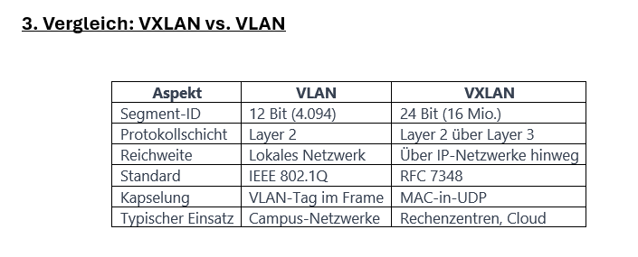
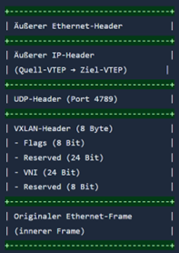
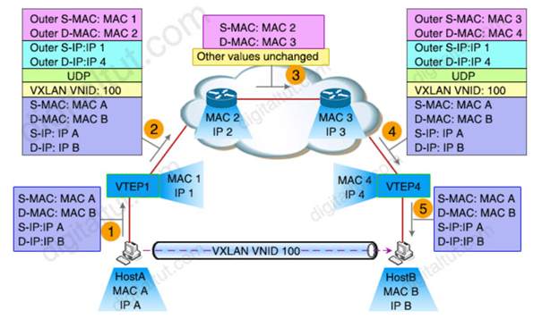

# VXLAN

## 1. Worum handelt es sich?

VXLAN (Virtual Extensible LAN) ist ein Netzwerk-Virtualisierungsprotokoll, das Layer-2-Ethernet-Frames in Layer-4-UDP-Pakete kapselt. Dadurch lassen sich virtuelle Layer-2-Netzwerke über eine bestehende IP-Infrastruktur (Layer 3) aufspannen.

VXLAN wurde ursprünglich von Cisco Systems, VMware und Arista Networks entwickelt und von der IETF (Internet Engineering Task Force) als Standard definiert.

---

## 2. In welchem Kontext wird der Begriff verwendet?

VXLAN macht immer dann Sinn, wenn klassische VLANs an ihre Grenzen stoßen. Das passiert vor allem in drei Szenarien:

### Wenn das Netzwerk zu groß für VLANs wird

VLANs erlauben maximal 4.094 getrennte Netzwerke. In einem kleinen Unternehmen reicht dies meistens. Bei großen Cloud-Anbietern wie z.B. AWS oder Azure mit tausenden Kunden sind 4.094 zu wenig.

VXLAN löst das Problem, da es 16 Millionen getrennte Netzwerke bietet.

### Wenn virtuelle Maschinen zwischen Servern oder Standorten verschoben werden müssen

Zum Beispiel im Rechenzentrum:

Eine VM läuft auf Server A in Wien und soll live auf Server B in Frankfurt verschoben werden (sogenannte Live-Migration).

Damit dies funktioniert, muss die VM ihre IP-Adresse behalten, andernfalls brechen alle bestehenden Verbindungen zusammen. Mit einem normalen gerouteten VLAN-Netzwerk ist dies unmöglich, weil IP-Adressen an Standorte gebunden sind.

VXLAN spannt ein virtuelles Layer-2-Netzwerk über das geroutete Layer-3-Netz auf, sodass die VM „nicht merkt“, dass sie umgezogen ist.

### Wenn mehrere Kunden dieselbe physische Infrastruktur teilen

Typisch bei Cloud-Anbietern oder Hosting-Firmen:

Kunde A und Kunde B teilen sich dieselben physischen Server und Switches, dürfen aber gegenseitig nichts voneinander sehen.

VXLAN isoliert die Netzwerke der Kunden vollständig – auch wenn sie auf denselben physischen Geräten laufen.

### Wann VXLAN nicht notwendig wäre

In einem kleinen Firmennetzwerk mit 50 PCs und 3 VLANs ist VXLAN nicht notwendig.

Die Komplexität lohnt sich erst ab einer gewissen Größenordnung, z.B. wenn Virtualisierung benötigt wird und das Unternehmen an mehreren Standorten vertreten ist.

---

## 3. Vergleich VXLAN vs. VLAN

---

## 4. Technische Funktionsweise

VXLAN basiert auf dem Prinzip eines Overlay-Netzwerks: Ein virtuelles Netzwerk wird über ein bestehendes physisches Netzwerk gelegt.

Man unterscheidet zwei Schichten:

- **Overlay:** Das virtuelle Layer-2-Netzwerk, in dem VMs und Container kommunizieren
- **Underlay:** Das physische IP-Netzwerk (Layer 3), das die eigentliche Datenübertragung übernimmt

Ein VXLAN-Paket setzt sich aus mehreren Protokollschichten zusammen, die den eigentlichen Ethernet-Frame kapseln. Der VXLAN-Header umfasst dabei 8 Byte und enthält zentrale Informationen zur Steuerung und Identifikation der Verbindung.

*Abbildung 1: https://ausbildung-in-der-it.de/lexikon/vxlan*

---

### MAC-in-UDP-Kapselung

Die Layer-2-Frames werden in UDP-Pakete gekapselt und über ein Layer-3-IP-Netzwerk übertragen.

Insgesamt stellt ein VXLAN 24 Bit für die Kennzeichnung von 16.777.215 verschiedenen Layer-2-Umgebungen bereit. Pro Layer-2-Umgebung sind wiederum 4.096 verschiedene VLANs möglich.

Der Header des Virtual Extensible VLANs besteht aus insgesamt acht Bytes, von denen der VNI 24 Bit belegt. Das UDP-Paket ist an den VXLAN-Port adressiert.

Der äußere IP-Header enthält die IP-Adressen der jeweiligen Virtual Tunnel Endpoints, an denen die Enkapsulierung der Layer-2-Daten stattfindet.

Das Virtual Extensible VLAN erzeugt insgesamt einen Overhead von 50 Bytes. Um Probleme mit der MTU (Maximum Transmission Unit) zu vermeiden und eine zusätzliche Fragmentierung der übertragenen Pakete zu verhindern, sollten alle an der VXLAN-Struktur beteiligten Geräte den Overhead berücksichtigen und eine einheitliche MTU unterstützen.

---

### Der VTEP (Virtual Tunnel Endpoint)

Die zentrale Komponente in einer VXLAN-Architektur ist der VTEP. Er bildet die Schnittstelle zwischen dem lokalen Layer-2-Netzwerk und dem VXLAN-Overlay.

Ein VTEP kann in einem physischen Switch, in einem Hypervisor oder als Software-Appliance implementiert sein.

Jeder VTEP besitzt zwei Schnittstellen:

- eine zum lokalen Netzwerk (Layer 2)
- eine zum Underlay-Netzwerk (Layer 3)

### Ablauf einer Übertragung

1. Das Quellgerät sendet einen normalen Ethernet-Frame an den lokalen VTEP.
2. Der VTEP prüft die Ziel-MAC-Adresse und ermittelt den zuständigen Remote-VTEP.
3. Der Ziel-VTEP entfernt alle äußeren Header und liefert den Original-Frame aus.

---

### Leaf-Spine-Architektur

Im Gegensatz zu klassischen Netzwerken nutzen physische VXLAN-Infrastrukturen meist sogenannte Leaf-Spine-Architekturen.

Diese haben sich als moderne und effiziente Netzwerktopologie etabliert und kommen besonders in Rechenzentren und großen Unternehmensnetzwerken zum Einsatz.

Die Leaf-Switches bilden die unterste Ebene der Architektur und sind direkt mit den Endgeräten verbunden.

---

## 5. Beispiel VXLAN Traffic Flow

Das folgende Beispiel veranschaulicht, wie VXLAN-Kommunikation zwischen zwei Hosts über ein IP-Netzwerk abläuft:

*Abbildung 2: https://www.digitaltut.com/vxlan-tutorial/2*

Die Grafik zeigt den Ablauf der VXLAN-Kommunikation zwischen zwei Hosts über ein IP-Netzwerk.

Zunächst sendet Host A einen normalen Ethernet-Frame an den lokalen VTEP1. Dieser kapselt den ursprünglichen Frame mit zusätzlichen VXLAN-, UDP- und IP-Headern ein und fügt die VNI (VXLAN Network Identifier) hinzu.

Anschließend wird das Paket über das Layer-3-Underlay-Netzwerk transportiert. Während der Übertragung ändern sich nur die äußeren MAC-Adressen der Router, die inneren Daten bleiben unverändert.

Am Ziel entfernt VTEP4 die zusätzlichen Header wieder (Decapsulation) und leitet den ursprünglichen Ethernet-Frame an Host B weiter.

Dadurch können sich beide Hosts so verhalten, als wären sie im selben Layer-2-Netzwerk, obwohl die Kommunikation über ein IP-Netzwerk erfolgt.

---

## 6. Protokolle, Produkte, Hersteller und Tools

### Standardisierung und Protokolle

Ursprünglich entwickelten VMware, Cisco Systems und Arista Networks das Virtual Extensible LAN. Es ist im RFC 7348 spezifiziert.

Auch andere Unternehmen wie Dell, OpenBSD, Red Hat, Citrix oder Broadcom unterstützen die Layer-2-Virtualisierungstechnik.

### Kommerzielle Produkte

VXLAN ist heute ein wichtiger Bestandteil moderner Netzwerkarchitekturen, beispielsweise:

- Cisco ACI
- VMware NSX
- EVPN-Fabrics

Die Technologie wird zunehmend auch in Container-Umgebungen wie Kubernetes über CNI-Plug-ins eingesetzt.

VXLAN ist vor allem in modernen Rechenzentrumsumgebungen und bei Cloud-Projekten im Einsatz.

Die Technologie wird häufig zusammen mit SDN-Lösungen wie VMware NSX, Cisco ACI oder Open vSwitch eingesetzt.

### Container und Kubernetes

Container-Orchestrierungsplattformen wie Kubernetes nutzen VXLAN-basierte Container Network Interfaces (CNI), um Netzwerkkonnektivität für containerisierte Anwendungen bereitzustellen.

Bekannte CNI-Plugins wie:

- Calico
- Flannel
- Cilium

setzen VXLAN ein, um Netzwerke in großem Maßstab zu implementieren.

### Diagnose und Fehleranalyse

Für die Fehleranalyse in VXLAN-Umgebungen ist ein gutes Verständnis der Kapselungsmechanismen wichtig.

Tools wie Wireshark können VXLAN-Pakete dekodieren und sowohl die äußeren als auch die inneren Header anzeigen.

Das hilft bei der Diagnose von Verbindungsproblemen zwischen VTEPs.

---

## 7. Vor- und Nachteile VXLAN

### Vorteile

- Hohe Skalierbarkeit: VXLAN ermöglicht die Erstellung von deutlich mehr Netzsegmenten als klassische VLANs.
- Flexible Standortvernetzung: Layer-2-Netzwerke können problemlos über IP-basierte Infrastrukturen hinweg erweitert werden.
- Einfache Migration von Workloads: Virtuelle Maschinen und Container lassen sich verschieben, ohne dass Anpassungen am Netzwerk erforderlich sind.
- Geeignet für Multi-Tenant-Umgebungen: Unterschiedliche Mandanten oder Kunden können sauber voneinander getrennt werden.
- Kompatibilität mit bestehender Infrastruktur: Das zugrunde liegende Netzwerk muss lediglich IP-Routing unterstützen.

### Nachteile

- Zusätzlicher Datenaufwand: Durch die Kapselung entstehen größere Pakete, was die Bandbreite stärker belastet.
- Anforderungen an die MTU: Damit die größeren Pakete verarbeitet werden können, sind oft angepasste MTU-Werte beziehungsweise Jumbo Frames notwendig.
- Komplexere Fehlersuche: Die Analyse von Netzwerkproblemen wird anspruchsvoller, da sowohl Underlay- als auch Overlay-Netzwerk betrachtet werden müssen.
- Höherer Konfigurationsaufwand: Ohne moderne Control-Plane-Lösungen wie BGP EVPN stößt die Skalierung schneller an Grenzen.

---

# Verwendete Quellen

- Donner, A. & Luber, S. (2019, 19. März). *Was ist VXLAN?* IP-Insider.  
  https://www.ip-insider.de/was-ist-vxlan-a-726595/

- Jacobs, D. (2025, 7. Juli). *VXLAN vs. VLAN: Was ist der Unterschied?* ComputerWeekly.de.  
  https://www.computerweekly.com/de/antwort/VXLAN-vs-VLAN-Was-ist-der-Unterschied

- SwitchFirewall. (o. D.). *Free network tools – Subnet, VLSM, IP Lookup.*  
  https://switchfirewall.com/articles/cisco-vxlan

- VXLAN. (2026, 17. Februar). *Ausbildung in der IT.*  
  https://ausbildung-in-der-it.de/lexikon/vxlan

- Wikipedia-Autoren. (2015, 14. April). *Virtual Extensible LAN.*  
  https://de.wikipedia.org/wiki/Virtual_Extensible_LAN

- DigitalTut. (o. D.). *VXLAN tutorial.*  
  https://www.digitaltut.com/vxlan-tutorial/2

- VXLAN. (o. D.). *Ausbildung in der IT.*  
  https://ausbildung-in-der-it.de/lexikon/vxlan
