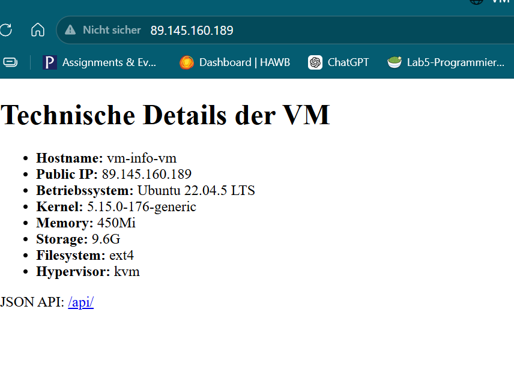
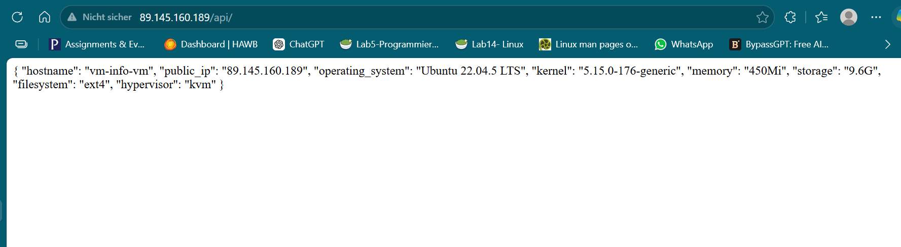

# Abgabe 2 - Automatisierte Exoscale Infrastruktur

## Ziel der Lösung

Diese Lösung erstellt automatisiert eine Ubuntu VM in Exoscale mithilfe von OpenTofu/Terraform und GitHub Actions.

Die VM wird automatisch mit CloudInit konfiguriert und stellt eine Website mit technischen Informationen über die VM bereit.

Zusätzlich wird ein JSON API Endpoint bereitgestellt.


## Verwendete Technologien

- Exoscale
- OpenTofu / Terraform
- GitHub Actions
- CloudInit
- Ubuntu 22.04 LTS
- Nginx
- Bash


## Bereitgestellte Endpunkte

### HTML Website

```text
z.B. http://89.145.160.189
```

Die Website zeigt technische Informationen der VM an.

Beispiele:
- Hostname
- IP Adresse
- Betriebssystem
- Kernel
- Speicher
- Filesystem
- Hypervisor


### JSON API

```text
z.B. http://89.145.160.189/api/
```

Der API Endpoint liefert dieselben Informationen im JSON Format.


## Infrastruktur

Folgende Komponenten werden automatisiert erstellt:

- Exoscale VM
- Security Group
- HTTP Regel (Port 80)
- SSH Regel (Port 22)
- Ubuntu 22.04 VM
- Webserver
- HTML Website
- JSON API Endpoint


## GitHub Actions

Es wurden zwei Workflows erstellt.

### Infrastruktur erstellen

Workflow:

```text
Create Exoscale Infrastructure
```

Dieser Workflow:
- initialisiert OpenTofu
- erstellt die Infrastruktur
- erstellt die VM


### Infrastruktur löschen

Workflow:

```text
Destroy Exoscale Infrastructure
```

Dieser Workflow entfernt:
- die VM
- Security Groups
- Terraform Ressourcen


## CloudInit

Die Konfiguration der VM erfolgt automatisiert über CloudInit.

Dabei werden:
- nginx installiert
- benötigte Pakete installiert
- HTML Dateien erstellt
- JSON Dateien erstellt
- technische Informationen gesammelt


## Verwendung

### Infrastruktur erstellen

1. GitHub öffnen
2. Actions öffnen
3. Workflow „Create Exoscale Infrastructure“ starten


### Infrastruktur löschen

1. GitHub öffnen
2. Actions öffnen
3. Workflow „Destroy Exoscale Infrastructure“ starten


## Screenshots

### Website



---

### API


